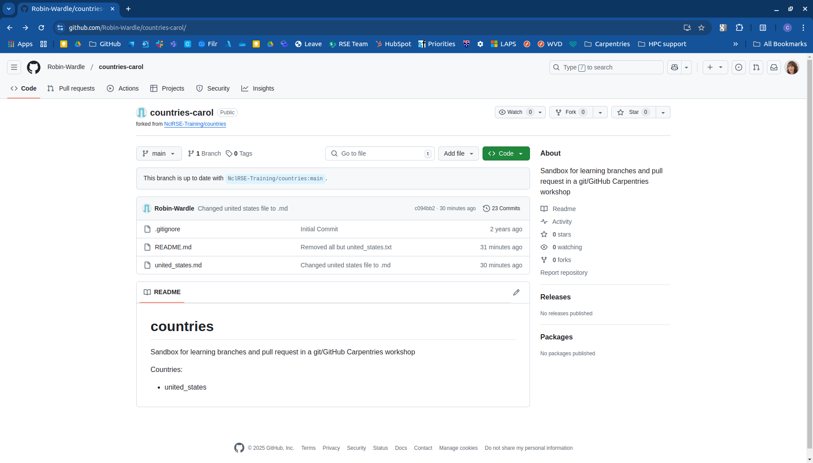
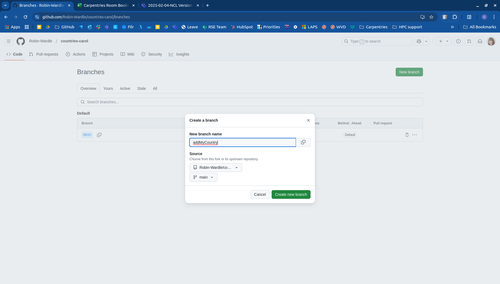
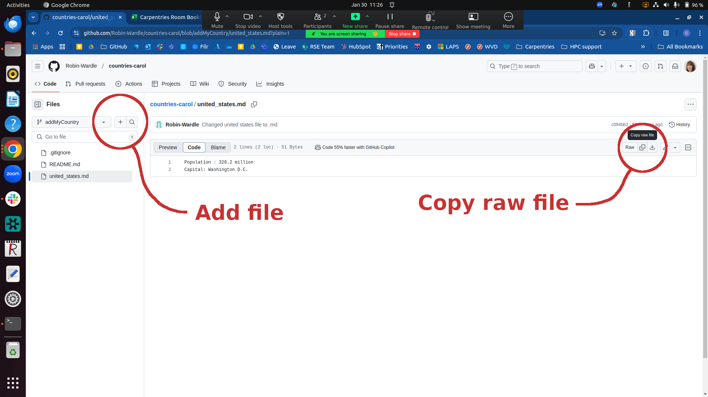
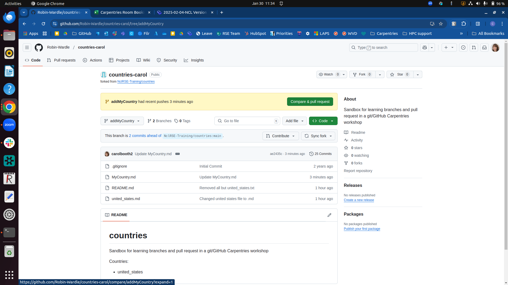
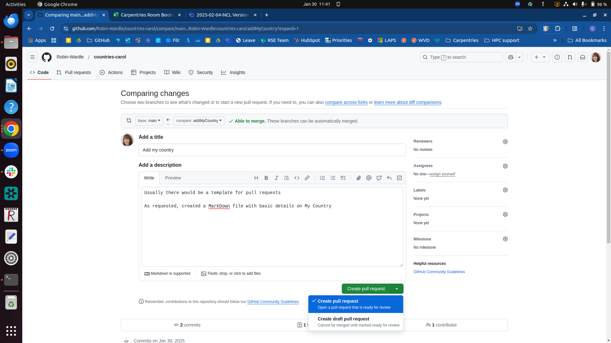
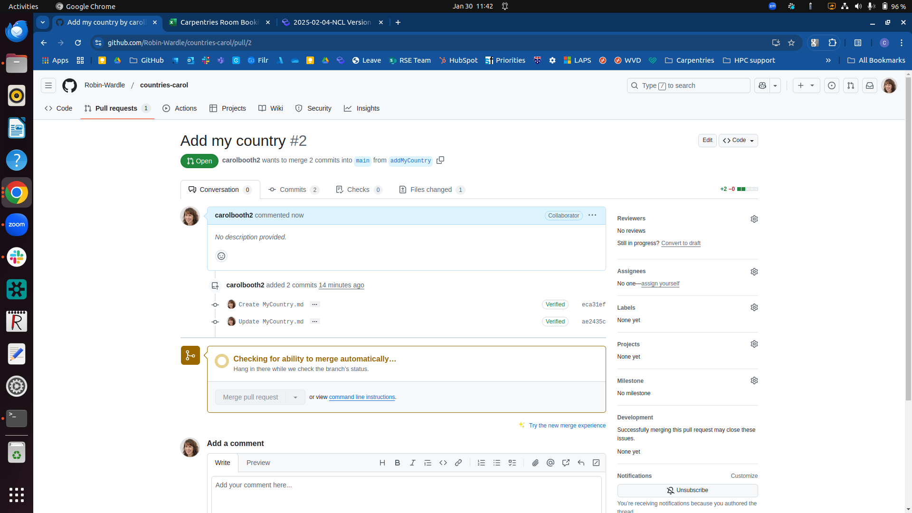
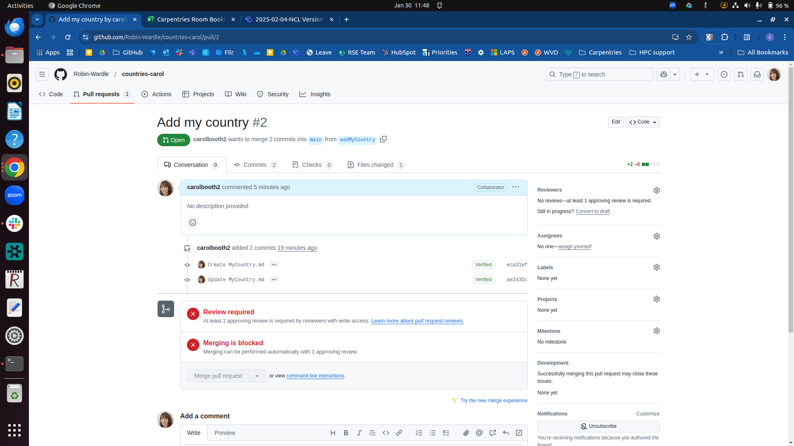
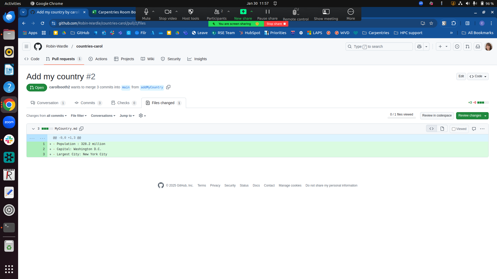
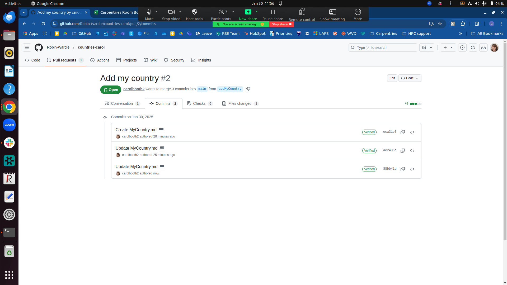

Pull requests are a great way to collaborate with others using github. Instead of making modifications directly to the main branch of a repository, you can propose a set of changes in a new branch. This can be useful if you don't have permission to modify a repository directly or you want someone else to review your changes.

For this lesson we will be working on the `countries` repository together. Open the github link for the `countries` repository provided by the instructor in your browser window.

> ## Repository owner differences
>
> The `countries` repository in this lesson's pictures 
> may belong to a GitHub organisation which doesn't match
> the one you were given by the instructor.
> This is to be expected because this will differ depending on 
> what organization your instructor used to setup the `countries` repository.
> 
> You will of course also see your GitHub username rather than the lesson designer's in the pictures.
> 
{: .callout}

> ## Requests to join a GitHub repository
>
> The instructors will have sent your GitHub account a request to join the
> repository as a collaborator. You will find this invitation by
> clicking on your GitHub Account picture (top right of the browser window)
> and selecting **Your organizations**. Select the **Accept invitation**
> button next to the lesson repository.
>
{: .callout}

The repository contains a list of Markdown files with some facts about a country. Each file is the name of a country and will contain the population of that country and its capital city. One country file is already in the repository and in this lesson each student will add a new country to the repository. However, you will not be able to commit changes directly to the main branch and will need to work in a new branch that you create.

First let's make a new branch to work on. This will keep our `main` branch
in sync with the authoritative version of the repository. We will name our branch descriptively after the country we will be adding. The lesson uses a branch named `editMyCountry` but you should name yours more descriptively.
Pick a country that no-one else is working on and add it to the course's collaborative document to avoid clashes with your fellow students.

Within the `countries` repository, once you have accepted your collaboration invitation, click **Branch** which can be found above the list of files, on the left. Previously, we created a branch on our local copy of a repository.  Now we are creating a branch directly in GitHub's copy of the repository. Click the **New branch** button at the top right, and enter a name for your branch. Select your branch from the list to start working on it.

To make our new country file we will copy the contents of file `united_states.md` and paste the contents into a new file with the name of our chosen country. _Hint: You may need to do some internet searching to fill in the information._   
* Click the name of the file you want to copy. 
* Click the "copy" icon (**Copy raw file**) next to **Raw** at the top right of the view /edit panel. 
* In the file navigator on the left, click the + (Add File) button at the top
  * Type your country name into the box **Name your file**
  * Click then paste into the edit panel
  * Change the text to reflect the details about your chosen country.

~~~
- Population: 66,991,000
- Capital: Paris
~~~
{: .output}

Click **Commit changes** at top right. In the pop up box, enter an extended description and click the **Commit Changes** button.

In many cases when working with GitHub repositories we may not have permission to push changes directly to the upstream or authoritative repositoryor we might like our changes to be reviewed regardless of permissions, so we'll create a `pull request`. A `pull request` is a **request** for a member of the upstream repository to **pull** our changes into the upstream repository from a branch. This process allows the repository administrators to request further changes or improvements and make comments on the changes before accepting them.

Click your repository name at the top of the page to return to the top level view. Github already suspects that we are going to want to make a pull request from our branch, so we can click the **Compare & pull request** button to start a new pull request.

In the Pull Request form, you will see *base* is main branch and *compare* is your new branch. In the **Add a description** box you should explain the changes you have made so that the pull request reviewer can assess your contribution. In a software engineering environment this could involve completing a formal commit template containing information such as which Issues the change fixes, which features it implements, and which tests have been run to ensure the change functions correctly.

Normally you would request a **Reviewer** from the list of repository owners - we won't do this in this exercise however. Then you can click the **Create pull request** button to submit the pull request. Note that you can click on the down arrow to change the pull request type to a "draft" if necessary. Once you initiate the pull request, GitHub will do some checks to see whether the change creates a conflict. In this case, because your file is not being worked on by anyone else, the checks should pass and GitHub will indicate that the change is ready to be merged into the `main` branch.

GitHub will now indicate that merging of your branch into the `main` branch is blocked, because the settings for the repository require a review first. Someone with the required privileges can now review your pull request, give comments and suggestions, and merge it into the main branch if they are satisfied with modifications you have made. In our pull request they can see any messages we left or click and look at the commits to see which files have changed.

Our collaborator reviewing the pull request noticed that we forgot to add the largest city, so let's add it and update our pull request.

~~~
Population: 66,991,000
Capital: Paris
Largest City: Paris
~~~
{: .output}

Next we will add and commit the changes requested by the reviewer.

Having done that, if we reload the pull request we'll see that the new commit was added to the pull request and the changes have been automatically updated. New commits pushed to the same branch are included in the previous pull request. If you want to suggest changes separately you need to make separate branches but if you want the changes to be considered together you should put them in the same branch.

Now the reviewer will re-consider your changes and (hopefully!) accept them, merging your branch into the main branch. Once your branch has been merged, it's good practice to delete it. Alternatively the group you are working in might have a policy where the repository owner or reviewer deletes all approved branches.

That's it! You created some new content for a repository which does not allow you to commit changes directly to the `main` branch. You did this by creating a new branch in GitHub, editing the file there, then committing it. You responded to a request for some re-work by the repository administrator, who then successfully merged your changes with the rest of the repository. Finally, you deleted your branch as it was no longer needed.

# Pull Requests - working locally
We don't have to work online in order to create a pull request from a branch. As a collaborator on the project, you can clone and branch locally as you did earlier. Open up your console and make a clone of the `countries` repository.

> ## Instead of copying the command below:
>
> You will have to replace '<ORGANISATION>' with the Organisation
> your instructor provided you with at the beginning of this lesson.
> 
{: .callout}
~~~
$ cd ~/Desktop
$ git clone git@github.com:<ORGANISATION>/countries.git
~~~
{: .bash}

~~~
Cloning into 'countries'...
remote: Counting objects: 6, done.
remote: Compressing objects: 100% (4/4), done.
remote: Total 6 (delta 0), reused 6 (delta 0), pack-reused 0
Unpacking objects: 100% (6/6), done.
~~~
{: .output}

Change directory into the repository and then check that the remote connections is the online GitHub repository.

~~~
$ cd countries
$ git remote -v
~~~
{: .bash}

~~~
origin	git@github.com:<ORGANISATION>/countries.git (fetch)
origin	git@github.com:<ORGANISATION>/countries.git (push)
~~~
{: .output}

Now that we have cloned the repository we will be able to suggest changes to this repository using a pull request. Each person will update their country's file with a National Dish (food for which the country is famous). Hint: It's fine to make something up or search the internet.

Let's make sure we have the most up-to-date copy of the remote repository from GitHub.

~~~
$ git pull
~~~
{: .bash}

Please use the same country as before so no one else chooses the same one. We will create the branch and switch into it in one step as we learned earlier in the branching lesson.

~~~
$ git checkout -b <branchName>
~~~
{: .bash}

~~~
Switched to a new branch '<branchName>'
~~~
{: .output}

Finally before we proceed to adding the new file, we will double 
check that we are on the right branch.

~~~
$ git branch
~~~
{: .bash}

~~~
* <branchName>
  main
~~~
{: .output}

Next use nano to edit the file for your chosen country, and add a National Dish.  
~~~
$ nano <MyCountry>.md
$ cat <MyCountry>.md
~~~
{: .bash}

~~~
Population: 66,991,000
Capital: Paris
National Dish: Pot-au-feu
~~~
{: .output}

Next let's add and commit the changes to the repository.

~~~
$ git status
$ git add <MyCountry>.md
$ git commit -m "Added National dish for <MyCountry>"
~~~
{: .bash}

~~~
[<branchName> 79a312a] Added National dish for <MyCountry>
 1 file changed, 2 insertions(+), 2 deletions(-)
~~~
{: .output}

As before, we can't or don't want to push changes directly to the main branch. We will create a `pull request` instead. In order to create a `pull request`, we must first push our new branch containing the changes we'd like to submit to the remote `origin`, on GitHub.

~~~
$ git push
~~~
{: .bash}

~~~
fatal: The current branch <branchName> has no upstream branch.
To push the current branch and set the remote as upstream, use

    git push --set-upstream origin <branchName>
~~~
{: .output}

~~~
$ git push origin <branchName>
~~~
{: .bash}

~~~
Enumerating objects: 5, done.
Counting objects: 100% (5/5), done.
Delta compression using up to 12 threads
Compressing objects: 100% (3/3), done.
Writing objects: 100% (3/3), 335 bytes | 335.00 KiB/s, done.
Total 3 (delta 2), reused 0 (delta 0), pack-reused 0
remote: Resolving deltas: 100% (2/2), completed with 2 local objects.
remote:
remote: Create a pull request for '<branchName>' on GitHub by visiting:
remote:      https://github.com/<ORGANISATION>/countries/pull/new/<branchName>
remote:
To github.com:<ORGANISATION>/countries.git
 * [new branch]      <branchName> -> <branchName>
~~~
{: .output}

Next go to the online repository on GitHub and reload the page. You will see that you recently pushed a new branch to the repository. If you wish to view your new branch you can click on the branch drop down menu and select it. Then you should be able to view the files and commits in that branch.

Github already suspects that we are going to want to make a pull request so we can click the **Compare & pull request** button to start a new pull request as we did earlier. The rest of the pull request process proceeds just as it did when working directly in GitHub. Note that pull requests as presented here are primarily a GitHub-based operation. It's rare that you will manage pull requests within `git` itself because that would involve your administering a repository directly that you allow others to connect to. Most of the time, we use Github or an equivalent repository system (such as GitLab or Bitbucket) to manage these sort of integration activities for us.
